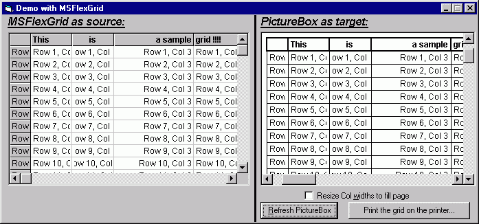



## A \(Flex\)Grid printing class, version 2

### Description

This class makes it easy to print a formatted grid on the printer, a PictureBox or a Form. You can set the font for the "normal" cols, the header cols and the footer cols, set the col alignment, the grid line thicknesses, the col widths, margins and other things. It also supports column and row merging. With a simple multi-page support !

This submission also includes a function (in a separate module) to "import" a MSFlexGrid allowing you to print such a grid quite easy.

Now it also includes such code for DBGrids and ListViews !

This code doesn't base on the MSFlexGrid or any other OCX !
 
### More Info
 

             |
---                |---
**Submitted On**   |2001-07-10 17:46:40
**By**             |[Jonas Wolz](https://github.com/Planet-Source-Code/PSCIndex/blob/master/ByAuthor/jonas-wolz.md)
**Level**          |Intermediate
**User Rating**    |4.7 (160 globes from 34 users)
**Compatibility**  |VB 4\.0 \(32\-bit\), VB 5\.0, VB 6\.0
**Category**       |[Miscellaneous](https://github.com/Planet-Source-Code/PSCIndex/blob/master/ByCategory/miscellaneous__1-1.md)
**World**          |[Visual Basic](https://github.com/Planet-Source-Code/PSCIndex/blob/master/ByWorld/visual-basic.md)
**Archive File**   |[A \(Flex\)Gr224917102001\.zip](https://github.com/Planet-Source-Code/jonas-wolz-a-flex-grid-printing-class-version-2__1-10312/archive/master.zip)

